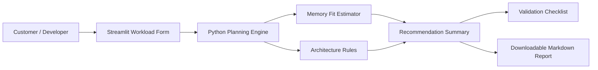
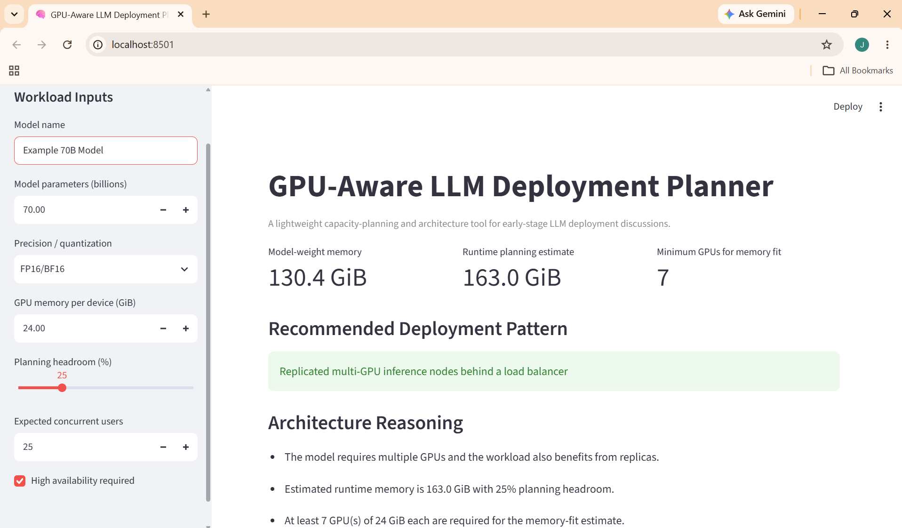

# GPU-Aware LLM Deployment Planner

A small customer-facing architecture tool that estimates whether an LLM can fit
within a selected GPU memory configuration and recommends a basic deployment
pattern.

## Why I Built It

Solutions architects often need to turn a customer's workload requirements into
a technical deployment plan. This project simulates an early-stage discovery
conversation for an LLM workload:

1. Gather workload requirements.
2. Estimate model memory requirements.
3. Compare the estimate with available GPU memory.
4. Recommend a single-node, multi-GPU, or replicated deployment pattern.
5. Clearly state assumptions and what must still be benchmarked before production.

The goal is not to replace benchmarking. The goal is to show structured
technical reasoning and communicate tradeoffs clearly.

## Features

- Model-weight memory estimation based on parameter count and precision
- Configurable runtime headroom rather than hidden assumptions
- Minimum GPU count estimate for memory fit
- Architecture recommendations based on memory fit, expected concurrency, and availability
- Customer-facing Markdown recommendation report
- Production validation checklist
- Streamlit interface
- Unit tests
- Dockerfile for containerized execution

## Architecture



## Example Scenario

A customer wants to deploy a 13B parameter model using FP16/BF16 precision.
The planner estimates model-weight memory, adds configurable planning headroom,
compares the requirement with GPU memory per device, and recommends an initial
architecture to validate.

This is a planning estimate only. Real inference performance depends on the
model architecture, serving framework, prompt/context length, batching, KV cache,
kernels, and quantization implementation.
### 70B High-Availability Example

The following scenario uses a 70B parameter model with FP16/BF16 precision,
24 GiB of GPU memory per device, 25 concurrent users, and high availability enabled.



## Quick Start

### Windows PowerShell

```powershell
python -m venv .venv
.venv\Scripts\Activate.ps1
pip install -r requirements.txt
streamlit run app.py
```

### macOS/Linux

```bash
python3 -m venv .venv
source .venv/bin/activate
pip install -r requirements.txt
streamlit run app.py
```

Run tests:

```bash
pytest
```

## Docker

```bash
docker build -t llm-gpu-planner .
docker run -p 8501:8501 llm-gpu-planner
```

Then open `http://localhost:8501`.

## What This Demonstrates

- Python application development
- AI/LLM infrastructure fundamentals
- GPU memory capacity reasoning
- Scalable architecture thinking
- Customer requirement analysis
- Technical documentation
- Containers and reproducibility
- Testing and validation mindset

## What I Would Add Next

- Real benchmark ingestion for measured latency and throughput
- GPU profiles and accelerator topology awareness
- Cost-per-request comparisons across deployment options
- Kubernetes deployment manifests
- NVIDIA Triton Inference Server integration
- Prometheus/Grafana observability
- Multi-node and high-performance networking considerations
- RAG workload profiles

## Interview Discussion

**Why not claim the calculator predicts production performance?**

Because GPU inference performance depends on many variables that a simple
parameter-memory calculation cannot capture. The tool treats memory fit as an
initial planning step and explicitly requires benchmarking and load testing
before production.

**How could this help a company?**

It gives a technical team a repeatable way to structure early workload discovery,
communicate assumptions, identify obvious capacity constraints, and produce a
starting architecture that can then be validated with real benchmarks.

**What did I learn?**

The biggest lesson was separating capacity planning from performance benchmarking.
A model fitting in GPU memory does not mean it will meet latency, throughput,
reliability, or cost requirements.
